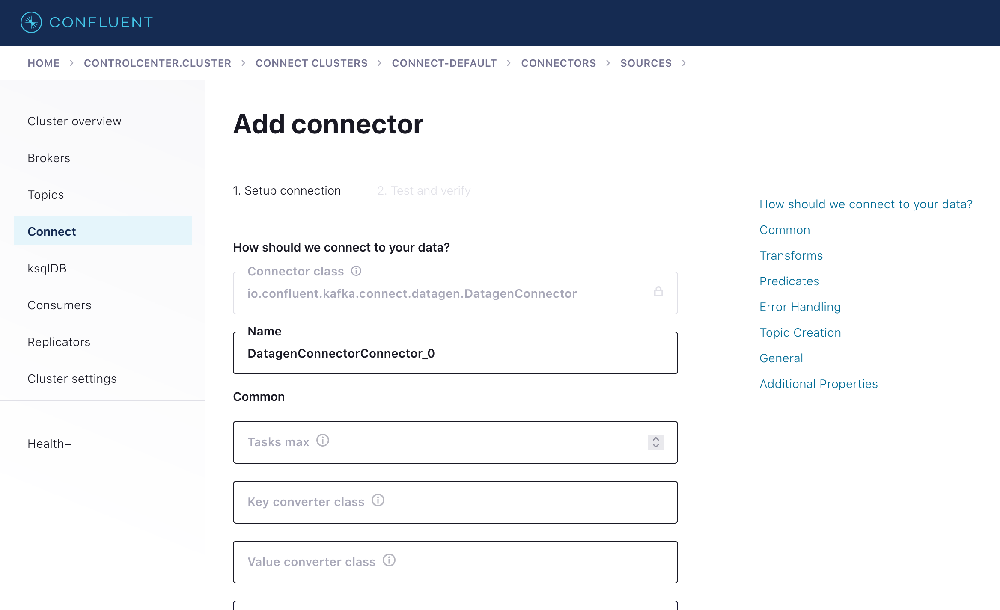
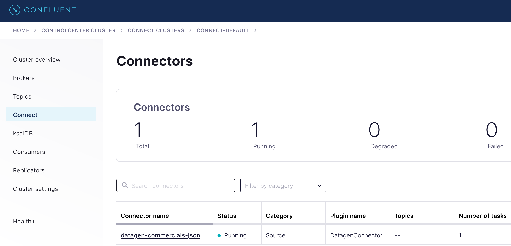
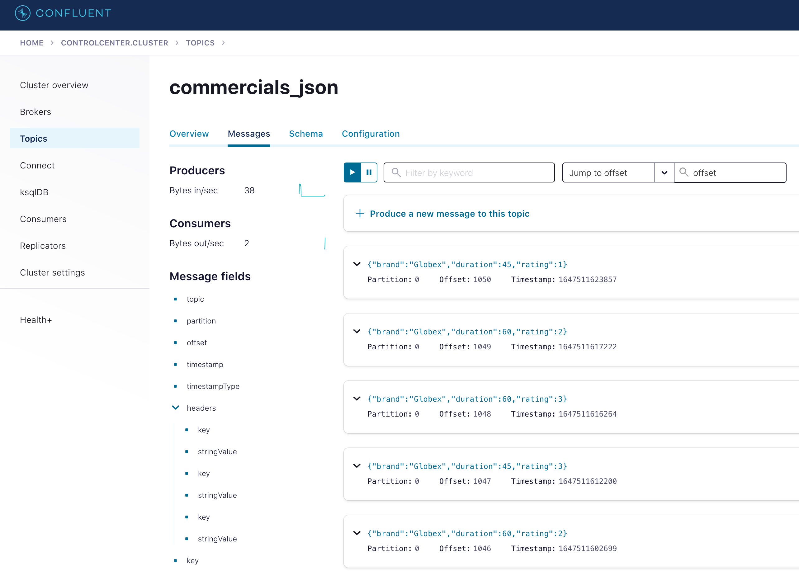
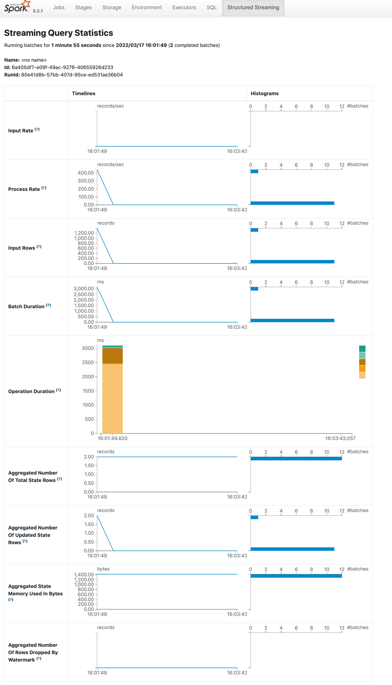
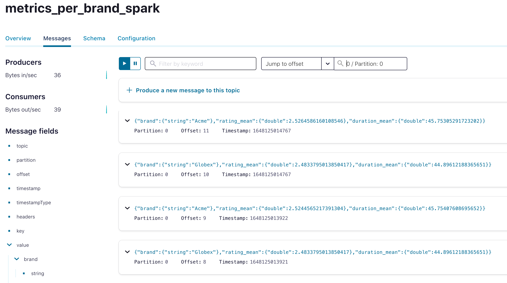
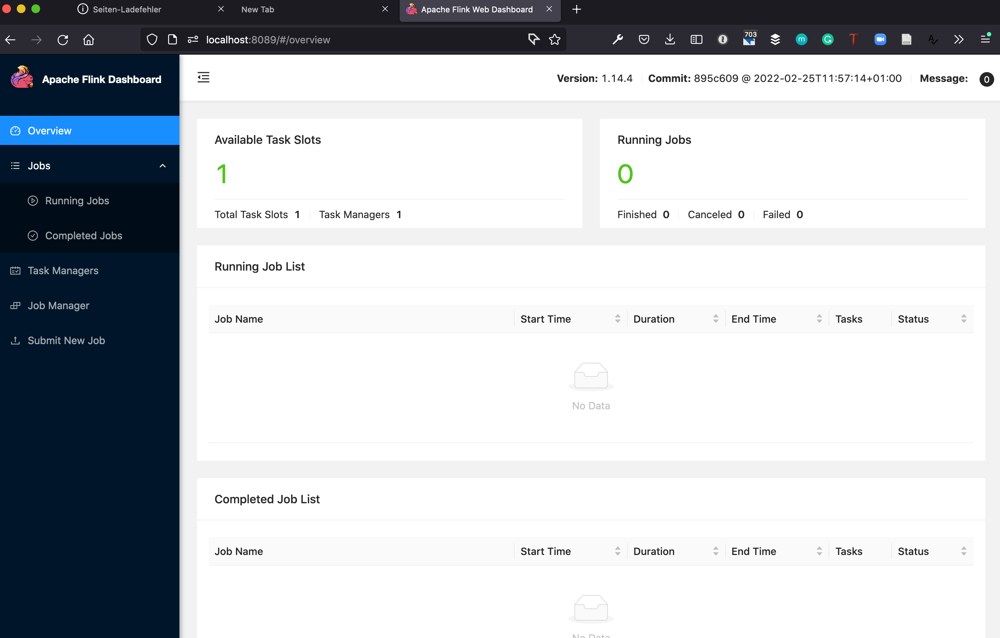

# streaming example

Using Avro dummy data created with [kafka-connect-datagen](https://github.com/confluentinc/kafka-connect-datagen) and a schema stored in the [Confluent schema registry](https://www.confluent.io/product/confluent-platform/data-compatibility/) I show how to process this data using a streaming engine.
The idea is to demonstrate reading the events from kafka, performing some abitrary computation and writing back to kafka.
I will focus on the SQL-(ish) APIs over the code-based ones in this demonstration.

The following two Streaming engines will be compared:

- Apache Spark
- Apache Flink
- Kafka SQL

> NOTICE: This is not meant for performance comparision. Spark i.e. does not offer an active master replication whereas flink guarantees high availability. 
> Indeed, the resource manager will restart the Spark master - however this additional delay (depending on the use-case) might not be acceptable.

## environment setup

To get access to a kafka installation please start a couple of docker containers:

```bash
docker-compose up
```
- Schema Registry: localhost:8081
- Control Center: localhost:9021

In case you have any problems: [the official Confluent quickstart guide](https://docs.confluent.io/platform/current/quickstart) is a good resource when looking for answers.

Flink and Spark both currently work well with JDK 8 or 11. The most recent LTS (17) is not yet fully supported.

[KafkaEsqu](https://kafka.esque.at/) is a great Kafka Development GUI.
The latest release however, requires a Java 17 installation or newer.
On OsX it might fail to start. To fix it follow the instructions in [the official readme](https://github.com/patschuh/KafkaEsque):

```bash
xattr -rd com.apple.quarantine kafkaesque-2.1.0.dmg
```


TODO flink setup!

TODO spark setup!

## generating dummy data

I follow the `Orders` example from the official Confluent example https://docs.confluent.io/5.4.0/ksql/docs/tutorials/generate-custom-test-data.html.
[https://thecodinginterface.com/blog/kafka-connect-datagen-plugin/](https://thecodinginterface.com/blog/kafka-connect-datagen-plugin/) might additionally be a good resource when you want to learn more about this stack. We follow their example schema:

Let's use a custom schema:

```bash
{
  "type": "record",
  "name": "commercialrating",
  "fields": [
    {
      "name": "brand",
      "type": {
        "type": "string",
        "arg.properties": {
          "options": ["Acme", "Globex"]
        }
      }
    }, 
    {
      "name": "duration",
      "type": {
        "type": "int",
        "arg.properties": {
          "options": [30, 45, 60]
        }
      }
    },
    {
      "name": "rating",
      "type": {
        "type": "int",
        "arg.properties": {
          "range": { "min": 1, "max": 5 }
        }
      } 
    }
  ]
}
```

Go to the [Confluent Control Center on: localhost:9021](localhost:9021) and select the **controlcenter.cluster** cluster.

You can either use the UI:



or use the REST API to POST the user-defined schema from above to the kafka connect data generator. For this you need to set some additional properties (like how many data points should be generated):

As JSON:

```
{
  "name": "datagen-commercials-json",
  "config": {
    "connector.class": "io.confluent.kafka.connect.datagen.DatagenConnector",
    "kafka.topic": "commercials_json",
    "schema.string": "{\"type\":\"record\",\"name\":\"commercialrating\",\"fields\":[{\"name\":\"brand\",\"type\":{\"type\": \"string\",\"arg.properties\":{\"options\":[\"Acme\",\"Globex\"]}}},{\"name\":\"duration\",\"type\":{\"type\":\"int\",\"arg.properties\":{\"options\": [30, 45, 60]}}},{\"name\":\"rating\",\"type\":{\"type\":\"int\",\"arg.properties\":{\"range\":{\"min\":1,\"max\":5}}}}]}",
    "schema.keyfield": "brand",
    "key.converter": "org.apache.kafka.connect.storage.StringConverter",
    "value.converter": "org.apache.kafka.connect.json.JsonConverter",
    "value.converter.schemas.enable": "false",
    "max.interval": 1000,
    "iterations": 1000,
    "tasks.max": "1"
  }
}
```

As AVRO with the Confluent schema registry:

```
{
  "name": "datagen-commercials-avro",
  "config": {
    "connector.class": "io.confluent.kafka.connect.datagen.DatagenConnector",
    "kafka.topic": "commercials_avro",
    "schema.string": "{\"type\":\"record\",\"name\":\"commercialrating\",\"fields\":[{\"name\":\"brand\",\"type\":{\"type\": \"string\",\"arg.properties\":{\"options\":[\"Acme\",\"Globex\"]}}},{\"name\":\"duration\",\"type\":{\"type\":\"int\",\"arg.properties\":{\"options\": [30, 45, 60]}}},{\"name\":\"rating\",\"type\":{\"type\":\"int\",\"arg.properties\":{\"range\":{\"min\":1,\"max\":5}}}}]}",
    "schema.keyfield": "brand",
    "key.converter": "org.apache.kafka.connect.storage.StringConverter",
    "value.converter": "io.confluent.connect.avro.AvroConverter",
    "value.converter.schema.registry.url": "http://schema-registry:8081",
    "value.converter.schemas.enable": "false",
    "max.interval": 1000,
    "iterations": 1000,
    "tasks.max": "1"
  }
}
```

Notice how only the serializeer changes from:

```
"key.converter": "org.apache.kafka.connect.storage.StringConverter",
"value.converter": "org.apache.kafka.connect.json.JsonConverter",
```

to:

```
"value.converter": "io.confluent.connect.avro.AvroConverter",
"value.converter.schema.registry.url": "http://schema-registry:8081",
```

when switching over to avro

Assuming you have stored this JSON snippet as a file named: `datagen-json-commercials-config.json` you can now interact with the REST API using:

```
curl -X POST -H "Content-Type: application/json" -d @datagen-json-commercials-config.json http://localhost:8083/connectors | jq
```

Observe the running connector:



But you can also check the status from the commandline:
```
curl http://localhost:8083/connectors/datagen-commercials-json/status | jq

curl http://localhost:8083/connectors/datagen-commercials-avro/status | jq
```

As a sanity check you can consume some records:

```
docker exec -it broker kafka-console-consumer --bootstrap-server localhost:9092 \
    --topic commercials_json --property print.key=true

docker exec -it broker kafka-console-consumer --bootstrap-server localhost:9092 \
    --topic commercials_avro --property print.key=true
```

These are also available in the UI of Confluent Control Center:



And KafkaEsque. But KafkaEsque needs to be configured first to view the kafka records:


Then the results are visible here:


To stop the connector simply either delete it in the UI of the control center or use the REST API:

```
curl -X DELETE http://localhost:8083/connectors/datagen-commercials-json

curl -X DELETE http://localhost:8083/connectors/datagen-commercials-avro
```

In case, the AVRO format is used for serializaiton, the schema registry will showcase the schema respectively:


## Analytics

In the following section I will present how to interact with the data stored in the `commercials_avro` topic using:

- [KSQL](https://www.confluent.io/blog/ksql-streaming-sql-for-apache-kafka/) in version of Confluent Platform 7.0.1
- [Spark Structured Streaming](https://spark.apache.org/docs/latest/structured-streaming-programming-guide.html) version 3.2.1
- [Flink (SQL like table API)](https://nightlies.apache.org/flink/flink-docs-release-1.14/docs/dev/table/tableapi/) verfsion 1.14.4

All tools offer the possibility for exactly once processing for a data pipeline with reads from kafka and writes to kafka (after performing a computation).

### Kafka SQL

The prime parameters are:

- topic
  - the original Kafka topic holding the data
- stream
  - unbounded: Storing a never-ending continuous flow of data
  - immutable: New event records are append-only for the log (kafka). No modifications of existing data are perfomed
- table
  - bounded: Represents a snapshot of the stream at a time, and therefore the temporal limits are well defined.
  - mutable: Any new data(`<Key, Value>` pair) that comes in is appended to the current table if the table does not have an existing entry with the same key. Otherwise, the existing record is mutated to have the latest value for that key.

There is a duality between streams and tables (stream as event log composing the table, table as the snapshot point-in-time version of a stream)

As a summary of the documentation found in:

- https://blog.knoldus.com/ksql-streams-and-tables/
- https://developer.confluent.io/learn-kafka/ksqldb/streams-and-tables/
- https://www.confluent.io/blog/kafka-streams-tables-part-3-event-processing-fundamentals/
- https://docs.ksqldb.io/en/latest/operate-and-deploy/schema-registry-integration/

Step 1: create a stream from a topic:

```
CREATE OR REPLACE STREAM metrics_brand_stream
  WITH (
    KAFKA_TOPIC='commercials_avro',
    VALUE_FORMAT='AVRO'
  );
```

> NOTICE: When submitting the query i.e. using the commandline or the ControlCenter UI ensure to decide if you want to start from:
>
> - latest: only new records will be processed
> - earliest: all existing records are processed

Step 2: create a materialized aggregation as a table. 

The follwing two types of queries are available (https://docs.ksqldb.io/en/latest/concepts/queries):

- push: client subscribes to a result as it changes in real-time
- pull: emits refinements to a stream or materialized table, which enables reacting to new information in real-time

A simple aggregation query can be prototyped (from the CLI or the ControlCenter UI):
```
SELECT brand,
         COUNT(*) AS cnt
  FROM metrics_brand_stream
  GROUP BY brand
  EMIT CHANGES;
```

and materialized as a table:

```
CREATE OR REPLACE TABLE metrics_per_brand AS
  SELECT brand,
         COUNT(*) AS cnt,
         AVG(duration) AS  duration_mean,
         AVG(rating) AS rating_mean
  FROM metrics_brand_stream
  GROUP BY brand
  EMIT CHANGES;
```
WARNING: why is the brand not part of the output? What is wrong here?

The table will emit changes automatically to any downstream consumer.

Perhaps a global aggregation is not desired, rather a time-based aggregation is needed.

The various window types https://docs.ksqldb.io/en/latest/concepts/time-and-windows-in-ksqldb-queries/ (tumbling, hopping, session) are explained well here.


Perhaps specific brands are of interest which are bout frequently:

```
CREATE OR REPLACE TABLE metrics_per_brand_windowed AS
SELECT BRAND, count(*)
FROM metrics_brand_stream
WINDOW TUMBLING (SIZE 5 SECONDS)
GROUP BY BRAND
HAVING count(*) > 3;
```

Exactly once handling: https://docs.ksqldb.io/en/latest/operate-and-deploy/exactly-once-semantics/

```
SET 'processing.guarantee' = 'exactly_once';
```

Do not forget to set consumer isolation level: https://stackoverflow.com/questions/69725764/ksqldb-exactly-once-processing-guarantee
for the kafka transactions.

> NOTICE: when browsing the topic which backs the KSQLDB table - the grouping key is not part of the value of the message.
> Rather, it is stored in the key of the message.

### Spark

step 1: Start spark with a connection to kafka and all the required jars enabled

In particular additional the following additional packages are used:

- https://github.com/AbsaOSS/ABRiS for making spark play nice with AVRO and schema registries
- default additional packages for kafka & avro support

Exception in thread "main" java.lang.IllegalArgumentException: requirement failed: Provided Maven Coordinates must be in the form 

'groupId:artifactId:version'. 
The coordinate provided is: 
org.apache.spark:org.apache.spark:spark-sql-kafka-0-10_2.12:3.2.1
```
spark-shell --master 'local[4]'\
	--repositories https://packages.confluent.io/maven \
    --packages org.apache.spark:spark-avro_2.12:3.2.1,org.apache.spark:spark-sql-kafka-0-10_2.12:3.2.1,za.co.absa:abris_2.12:6.2.0 \
    --conf spark.sql.shuffle.partitions=4

```

In case you are using spark behind a corporate proxy use:

- https://stackoverflow.com/questions/36676395/how-to-resolve-external-packages-with-spark-shell-when-behind-a-corporate-proxy
- https://godatadriven.com/blog/spark-packages-from-a-password-protected-repository/


Step 2: connect spark to kafka

Read the raw records

> HINT: for quick debuging it might be useful to turn `readStream` into the `read` function.

```
val df = spark
  .read
  //.readStream
  .format("kafka")
  .option("kafka.bootstrap.servers", "localhost:9092")
  //.option("startingOffsets", "earliest") // start from the beginning each time
  .option("subscribe", "commercials_avro")
  .load()

```

Take notice how the value is a binary field (AVRO):

```
df.printSchema
root
 |-- key: binary (nullable = true)
 |-- value: binary (nullable = true)
 |-- topic: string (nullable = true)
 |-- partition: integer (nullable = true)
 |-- offset: long (nullable = true)
 |-- timestamp: timestamp (nullable = true)
 |-- timestampType: integer (nullable = true)
```

Parsing the Avro (sing the Schema stored in the Schema Registry)

```
import za.co.absa.abris.config.AbrisConfig
val abrisConfig = AbrisConfig
  .fromConfluentAvro
  .downloadReaderSchemaByLatestVersion
  .andTopicNameStrategy("commercials_avro")
  .usingSchemaRegistry("http://localhost:8081")

import za.co.absa.abris.avro.functions.from_avro
val deserialized = df.select(from_avro(col("value"), abrisConfig) as 'data).select("data.*")
deserialized.printSchema

root
 |-- brand: string (nullable = true)
 |-- duration: integer (nullable = true)
 |-- rating: integer (nullable = true)


```

Step 3: switch to a streaming query 

> HINT: turn `read` into the `readStream` function above.

```
val df = spark
  .readStream
  .format("kafka")
  .option("kafka.bootstrap.servers", "localhost:9092")
  .option("startingOffsets", "earliest") // start from the beginning each time
  .option("subscribe", "commercials_avro")
  .load()

import za.co.absa.abris.config.AbrisConfig
val abrisConfig = AbrisConfig
  .fromConfluentAvro
  .downloadReaderSchemaByLatestVersion
  .andTopicNameStrategy("commercials_avro")
  .usingSchemaRegistry("http://localhost:8081")

import za.co.absa.abris.avro.functions.from_avro
val deserialized = df.withColumn("data", from_avro(col("value"), abrisConfig))
deserialized.printSchema

root
 |-- key: binary (nullable = true)
 |-- value: binary (nullable = true)
 |-- topic: string (nullable = true)
 |-- partition: integer (nullable = true)
 |-- offset: long (nullable = true)
 |-- timestamp: timestamp (nullable = true)
 |-- timestampType: integer (nullable = true)
 |-- data: struct (nullable = true)
 |    |-- brand: string (nullable = false)
 |    |-- duration: integer (nullable = false)
 |    |-- rating: integer (nullable = false)


// in non streaming mode:
// deserialized.groupBy("data.brand").count.show
// in streaming mode:
val query = deserialized.groupBy("data.brand").count.writeStream
  .outputMode("complete")
  .format("console")
  .start()


// to stop query in interactive shell and continue development
query.stop
// to block session
// query.awaitTermination()
```

> NOTICE: the output modes https://spark.apache.org/docs/latest/structured-streaming-programming-guide.html#output-modes
> 
> - append (default): new rowas are added
> - complete: final aggregation result
> - update: only updates are pushed on


outputted batch updates

```
-------------------------------------------
Batch: 0
-------------------------------------------
+------+-----+
| brand|count|
+------+-----+
|Globex|  694|
|  Acme|  703|
+------+-----+

-------------------------------------------
Batch: 1
-------------------------------------------
+------+-----+
| brand|count|
+------+-----+
|Globex|  695|
|  Acme|  703|
+------+-----+
```

Make sure to visit http://localhost:4040/StreamingQuery/ Also look at the nice UI new in Spark 3.x
> Tuning hint: look at the shuffle partitions! This is crucial now. I can already tell you that the default 200 are way too slow.



Now back to the windowed streaming query:

```
// non streaming
deserialized.select($"timestamp", $"data.*")
  .withWatermark("timestamp", "10 minutes")
  .groupBy(window($"timestamp", "5 seconds"), $"brand").count
  .filter($"count" > 3)
  .show(false)

// streaming
val query = deserialized.select($"timestamp", $"data.*")
  .withWatermark("timestamp", "10 minutes")
  .groupBy(window($"timestamp", "5 seconds"), $"brand").count
  .filter($"count" > 3)
  .writeStream
  .outputMode("complete")
  .format("console")
  .start()
  
query.stop

// deserialized.groupBy("brand").agg(mean($"rating").alias("rating_mean"), mean($"duration").alias("duration_mean")).show

val aggedDf = deserialized.withWatermark("timestamp", "10 minutes").groupBy($"data.brand").agg(mean($"data.rating").alias("rating_mean"), mean($"data.duration").alias("duration_mean"))

// https://github.com/AbsaOSS/ABRiS/blob/master/documentation/confluent-avro-documentation.md

import za.co.absa.abris.avro.parsing.utils.AvroSchemaUtils

// generate schema for all columns in a dataframe
val schema = AvroSchemaUtils.toAvroSchema(aggedDf)
val schemaRegistryClientConfig = Map(AbrisConfig.SCHEMA_REGISTRY_URL -> "http://localhost:8081")

import za.co.absa.abris.avro.read.confluent.SchemaManagerFactory
val schemaManager = SchemaManagerFactory.create(schemaRegistryClientConfig)

// register schema with topic name strategy
// needed to execute once (per schema upgrade) not for each microbatch
import org.apache.avro.Schema
import za.co.absa.abris.avro.read.confluent.SchemaManager
import za.co.absa.abris.avro.registry.SchemaSubject
def registerSchema1(schema: Schema, schemaManager: SchemaManager, schemaName:String, isKey:Boolean): Int = {
  val subject = SchemaSubject.usingTopicNameStrategy(schemaName, isKey)
  schemaManager.register(subject, schema)
}

val schemaIDAfterRegistration = registerSchema1(schema, schemaManager, "metrics_per_brand_spark", isKey=true)

val toAvroConfig4 = AbrisConfig
    .toConfluentAvro
    .downloadSchemaByLatestVersion
    .andTopicNameStrategy("metrics_per_brand_spark")
    .usingSchemaRegistry("http://localhost:8081")

import za.co.absa.abris.avro.functions.to_avro
import org.apache.spark.sql._
import za.co.absa.abris.config.ToAvroConfig

def writeDfToAvro(toAvroConfig: ToAvroConfig)(dataFrame:DataFrame) = {
  // this is the key! need to keep the key to guarantee temporal ordering
  val availableCols = dataFrame.columns//.drop("brand").columns
  val allColumns = struct(availableCols.head, availableCols.tail: _*)
  //dataFrame.select(to_avro($"brand", toAvroConfig).alias("key_brand"), to_avro(allColumns, toAvroConfig) as 'value)
  dataFrame.select($"brand".alias("key_brand"), to_avro(allColumns, toAvroConfig) as 'value)
}


val aggedAsAvro = aggedDf.transform(writeDfToAvro(toAvroConfig4))
aggedAsAvro.printSchema

val keySchema = AvroSchemaUtils.toAvroSchema(aggedDf.select($"brand".alias("key_brand")), "key_brand")
schemaManager.register(SchemaSubject.usingTopicNameStrategy("metrics_per_brand_spark", true), schema)

val query = aggedAsAvro.writeStream
    .format("kafka")
    .option("kafka.bootstrap.servers", "localhost:9092")
    .option("topic", "metrics_per_brand_spark")
    .outputMode("update")
    .option("checkpointLocation", "my_query_checkpoint_dir") // preferably on a distributed fault tolerant storage system
    .start()
query.stop

https://spark.apache.org/docs/latest/structured-streaming-programming-guide.html#output-modes
TODO try other output mode:
.outputMode("update")
query


https://stackoverflow.com/questions/40872520/whats-the-purpose-of-kafkas-key-value-pair-based-messaging
 Specifying the key so that all messages on the same key go to the same partition is very important for proper ordering of message processing if you will have multiple consumers in a consumer group on a topic.

Without a key, two messages on the same key could go to different partitions and be processed by different consumers in the group out of order.ooo
```

https://github.com/AbsaOSS/ABRiS/issues/291

generated AVRO schema:

```
{
  "fields": [
    {
      "name": "brand",
      "type": [
        "string",
        "null"
      ]
    },
    {
      "name": "rating_mean",
      "type": [
        "double",
        "null"
      ]
    },
    {
      "name": "duration_mean",
      "type": [
        "double",
        "null"
      ]
    }
  ],
  "name": "topLevelRecord",
  "type": "record"
}
```

complete results



how to consume this topic???

this is only using the console:
  .format("console")

instead a kafka sink should be used!

> NOTICE: here additoinally https://spark.apache.org/docs/latest/structured-streaming-programming-guide.html#handling-event-time-and-late-data late arriving data is handled gracefully with the watermark (could have been added in KSQLDB as well, omitted for sake fo brevity)

https://docs.databricks.com/spark/latest/structured-streaming/demo-notebooks.html#structured-streaming-demo-scala-notebook for more great examples


FYI: See https://spark.apache.org/docs/latest/structured-streaming-programming-guide.html#rocksdb-state-store-implementation for an efficient and scalable state store implementation for large scale streaming queries.

further great information:

- https://medium.com/datapebbles/kafka-to-spark-structured-streaming-with-exactly-once-semantics-35e4281525fc
- https://docs.microsoft.com/en-us/azure/hdinsight/spark/apache-spark-streaming-exactly-once
- https://sbanerjee01.medium.com/exactly-once-processing-with-spark-structured-streaming-f2a78f45a76a

Exactly once processing semantcis:

- state store
- WAL write ahead log
- checkpoints https://spark.apache.org/docs/latest/structured-streaming-programming-guide.html#recovering-from-failures-with-checkpointing

obviously both must store to a persistent volume.

In case of kafka its transactional capabilities may need to be used.

depending on the use-case https://tech.scribd.com/blog/2021/kafka-delta-ingest.html might be better than a generic streaming framework for streaming data ingestion into a lake.

Furthermore: potentially (to easily allow for efficien full scans i.e. to avoid having one system in Kafka and one in Blog storage/lake) DELTA tables (with compaction enabled) might be cheaper when a bit more latency can be tolerated after initially sinking the data over from Kafka to a long term storage solution (using it only as a buffer).

### Flink

first steps with flink:
https://nightlies.apache.org/flink/flink-docs-release-1.14//docs/try-flink/local_installation/

setup as in: https://nightlies.apache.org/flink/flink-docs-release-1.14/docs/connectors/table/formats/avro-confluent/ 

notice we are using here the 2.12 edition of scala
further notice: we add the sql-* uber jars! When not using a build tool this is super important. Otherwise you need to specify many transitive dependencies which is super cumbersome.

```
cd flink-1.14.4/


wget https://repo1.maven.org/maven2/org/apache/flink/flink-sql-connector-kafka_2.12/1.14.4/flink-sql-connector-kafka_2.12-1.14.4.jar -P lib/
wget https://repo1.maven.org/maven2/org/apache/flink/flink-sql-avro-confluent-registry/1.14.4/flink-sql-avro-confluent-registry-1.14.4.jar -P lib/
```

as all the kafka and other docker containers have a clashing port range with flink's default settings, please change:

```
vi conf/flink-conf.yaml

# and set:
rest.port: 8089
```

the start flink

```
./bin/start-cluster.sh local
ps aux | grep flink

./bin/sql-client.sh
```


flink UI http://localhost:8089/



in case it is not showing up - check the logs which are created in the log folder for any exception describing the problem.

- https://diogodssantos.medium.com/dont-leave-apache-flink-and-schema-registry-alone-77d3c2a9c787


scala shell moved 
https://github.com/zjffdu/flink-scala-shell
as per https://lists.apache.org/thread/pojsrrdckjwow5186nd7hn9y5j9t29ov

Zeppelin https://zeppelin.apache.org/docs/latest/interpreter/flink.html has an interactive interpreter though.


following along with https://nightlies.apache.org/flink/flink-docs-master/docs/dev/table/sqlclient/ and https://nightlies.apache.org/flink/flink-docs-release-1.14/docs/connectors/table/kafka/ and

https://nightlies.apache.org/flink/flink-docs-release-1.14/docs/connectors/table/formats/avro-confluent/


https://lists.apache.org/list.html?user@flink.apache.org
flink SQL client with kafka confluent avro binaries setup

TODO: discuss watermarks
https://nightlies.apache.org/flink/flink-docs-master/docs/dev/datastream/event-time/generating_watermarks/
perhpas globally? Also triggers/the impact of watermarks

```sql
drop table metrics_brand_stream;
CREATE TABLE metrics_brand_stream (
    `event_time` TIMESTAMP(3) METADATA FROM 'timestamp',
    --WATERMARK FOR event_time AS event_time - INTERVAL '10' MINUTE,
  `partition` BIGINT METADATA VIRTUAL,
  `offset` BIGINT METADATA VIRTUAL,
    brand string,
    duration int,
    rating int
    
) WITH (
    'connector' = 'kafka',
    'topic' = 'commercials_avro',
    'scan.startup.mode' = 'earliest-offset',
    'format' = 'avro-confluent',
    'avro-confluent.schema-registry.url' = 'http://localhost:8081/',
    'properties.group.id' = 'flink-test-001',
    'properties.bootstrap.servers' = 'localhost:9092'
);

CREATE TABLE ms (
    brand string,
    duration DOUBLE,
    rating DOUBLE
    
) WITH (
    'connector' = 'kafka',
    'topic' = 'commercials_avro',
    'scan.startup.mode' = 'earliest-offset',
    'format' = 'avro-confluent',
    'avro-confluent.schema-registry.url' = 'http://localhost:8081/',
    'properties.group.id' = 'flink-test-001',
    'properties.bootstrap.servers' = 'localhost:9092'
);

SELECT * FROM metrics_brand_stream;

SELECT AVG(duration) AS  duration_mean, AVG(CAST(rating AS DOUBLE)) AS rating_mean FROM metrics_brand_stream;
!! Manual type cast!!!
SELECT AVG(duration) AS  duration_mean, AVG(rating) AS rating_mean FROM ms;

SELECT brand,
         COUNT(*) AS cnt,
         AVG(duration) AS  duration_mean,
         AVG(rating) AS rating_mean
  FROM metrics_brand_stream
  GROUP BY brand;


DROP TABLE metrics_per_brand;
'connector' = 'upsert-kafka',
'connector' = 'kafka',
CREATE TABLE metrics_per_brand (
    brand string,
    cnt BIGINT,
    duration_mean DOUBLE,
    rating_mean DOUBLE
    ,PRIMARY KEY (brand) NOT ENFORCED
    
) WITH (
    'connector' = 'upsert-kafka',
    'topic' = 'metrics_per_brand_flink',
    'properties.group.id' = 'flink-test-001',
    'properties.bootstrap.servers' = 'localhost:9092',

    'key.format' = 'avro-confluent',
    'key.avro-confluent.schema-registry.subject' = 'metrics_per_brand_flink-key',
    'key.avro-confluent.schema-registry.url' = 'http://localhost:8081/',

    'value.format' = 'avro-confluent',
    'value.avro-confluent.schema-registry.subject' = 'metrics_per_brand_flink-value',
    'value.avro-confluent.schema-registry.url' = 'http://localhost:8081/'
    
);
INSERT INTO metrics_per_brand
  SELECT brand,
         COUNT(*) AS cnt,
         AVG(duration) AS  duration_mean,
         AVG(rating) AS rating_mean
  FROM metrics_brand_stream
  GROUP BY brand;

select * from country_target;


https://nightlies.apache.org/flink/flink-docs-release-1.14/docs/dev/datastream/fault-tolerance/checkpointing/#enabling-and-configuring-checkpointing
SET 'state.checkpoints.dir' = 'hdfs:///my/streaming_app/checkpoints/';
SET 'execution.checkpointing.mode' = 'EXACTLY_ONCE';
SET 'execution.checkpointing.interval' = '30min';
SET 'execution.checkpointing.min-pause' = '20min';
SET 'execution.checkpointing.max-concurrent-checkpoints' = '1';
SET 'execution.checkpointing.prefer-checkpoint-for-recovery' = 'true';
```

https://nightlies.apache.org/flink/flink-docs-master/docs/connectors/table/upsert-kafka/

query experimentation:

```sql

```

result materialization (read from kafka, write to kafka):

```sql

```

commercial example https://www.ververica.com/blog/ververica-platform-2.3-getting-started-with-flink-sql-on-ververica-platform

stop the shell

```
// ./bin/taskmanager.sh start
# to start more taskmanagers


./bin/stop-cluster.sh
```

certainly a fully fledged flink program might include:

- unit tests
- perhaps custom functionalities for triggers 
- additional libraries for specific tasks i.e. gespatial tasks

such a more realistic job should be constructed using a build tool like Gradle and the Java or Scala API of flink.

Nonetheless for simple (traditional) ETL-style transformations the SQL DSL of flink (including CEP) can already be what you need.
https://nightlies.apache.org/flink/flink-docs-master/docs/dev/table/sql/queries/match_recognize/


Furthermore when handling multiple event types in a single topic:
https://diogodssantos.medium.com/dont-leave-apache-flink-and-schema-registry-alone-77d3c2a9c787

would require custom code.

https://nightlies.apache.org/flink/flink-docs-release-1.14/docs/dev/datastream/fault-tolerance/checkpointing/#enabling-and-configuring-checkpointing

exactly once needs a) checkpointing b) kafka transactions enabled

## new streaming databases

new streaming databases are up-and-coming:

- https://www.theseattledataguy.com/7-real-time-data-streaming-databases-which-one-is-right-for-you/#page-content
- https://materialize.com/blog-rocksdb/
https://blog.getdbt.com/dbt-materialize-streaming-to-a-dbt-project-near-you/ 


materialize: https://github.com/MaterializeInc/mz-hack-day-2022
https://www.youtube.com/watch?v=Kv9FCfZjgy0


https://redpanda.com/ and pulsar


TODO: add a working https://github.com/MaterializeInc/mz-hack-day-2022 example here (adapted to our avro stuff)

using docker: https://materialize.com/docs/get-started/


```
materialized --workers=1 # in one terminal

psql -U materialize -h localhost -p 6875 materialize # in another terminal

DROP SOURCE metrics_brand_stream_m;

CREATE MATERIALIZED SOURCE metrics_brand_stream_m
  FROM KAFKA BROKER 'localhost:9092' TOPIC 'commercials_avro'
  FORMAT AVRO USING CONFLUENT SCHEMA REGISTRY 'http://localhost:8081'

  INCLUDE PARTITION, OFFSET, TIMESTAMP AS ts
  ENVELOPE NONE;


SELECT * FROM metrics_brand_stream_m;
SELECT brand,
         COUNT(*) AS cnt,
         AVG(duration) AS  duration_mean,
         AVG(rating) AS rating_mean
  FROM metrics_brand_stream_m
  GROUP BY brand;

CREATE MATERIALIZED VIEW metrics_per_brand_view AS
SELECT brand,
         COUNT(*) AS cnt,
         AVG(duration) AS  duration_mean,
         AVG(rating) AS rating_mean
  FROM metrics_brand_stream_m
  GROUP BY brand;

CREATE SINK metrics_per_brand
FROM metrics_per_brand_view
INTO KAFKA BROKER 'localhost:9092' TOPIC 'metrics_per_brand_materialize'
KEY (brand)
FORMAT AVRO USING
    CONFLUENT SCHEMA REGISTRY 'http://localhost:8081';
```

https://materialize.com/docs/guides/dbt/

exactly once processing is supported.

TODO add DBT example here


https://redpanda.com/


## summary

problems of batch data pipelines

The code for this blog post is available at: XXX TODO XXX


Furthermore, see: https://github.com/geoHeil/streaming-reference as a great example how to include NiFi and ELK for Data collection and visualization purposes.

https://www.slideshare.net/SparkSummit/what-no-one-tells-you-about-writing-a-streaming-app-spark-summit-east-talk-by-mark-grover-and-ted-malaska

flink HA master - spark not

KSQL(db): inferior https://www.jesse-anderson.com/2019/10/why-i-recommend-my-clients-not-use-ksql-and-kafka-streams/
grouping keys with multiple columns: manual partitioning necessary
https://www.confluent.io/blog/ksqldb-0-15-reads-more-message-keys-supports-more-data-types/ all steps add to latency

problems of established streaming solutions

brief mention of new databases + kafka alternatives


spark abris issues + dynamic frame