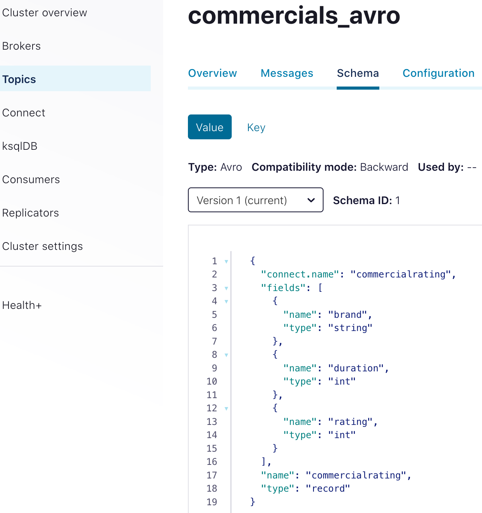

# streaming example

Using Avro dummy data created with [kafka-connect-datagen](https://github.com/confluentinc/kafka-connect-datagen) and a schema stored in the [Confluent schema registry](https://www.confluent.io/product/confluent-platform/data-compatibility/) I show how to process this data using a streaming engine.
The idea is to demonstrate reading the events from kafka, performing some abitrary computation and writing back to kafka.
I will focus on the SQL-(ish) APIs over the code-based ones in this demonstration.

The following two Streaming engines will be compared:

- Apache Spark
- Apache Flink
- Kafka SQL

> NOTICE: This is not meant for performance comparision. Spark i.e. does not offer an active master replication whereas flink guarantees high availability. 
> Indeed, the resource manager will restart the Spark master - however this additional delay (depending on the use-case) might not be acceptable.

## environment setup

To get access to a kafka installation please start a couple of docker containers:

```bash
docker-compose up
```
- Schema Registry: localhost:8081
- Control Center: localhost:9021

In case you have any problems: [the official Confluent quickstart guide](https://docs.confluent.io/platform/current/quickstart) is a good resource when looking for answers.

Flink and Spark both currently work well with JDK 8 or 11. The most recent LTS (17) is not yet fully supported.

[KafkaEsqu](https://kafka.esque.at/) is a great Kafka Development GUI.
The latest release however, requires a Java 17 installation or newer.
On OsX it might fail to start. To fix it follow the instructions in [the official readme](https://github.com/patschuh/KafkaEsque):

```bash
xattr -rd com.apple.quarantine kafkaesque-2.1.0.dmg
```

## generating dummy data

I follow the `Orders` example from the official Confluent example https://docs.confluent.io/5.4.0/ksql/docs/tutorials/generate-custom-test-data.html.
[https://thecodinginterface.com/blog/kafka-connect-datagen-plugin/](https://thecodinginterface.com/blog/kafka-connect-datagen-plugin/) might additionally be a good resource when you want to learn more about this stack. We follow their example schema:

Let's use a custom schema:

```bash
{
  "type": "record",
  "name": "commercialrating",
  "fields": [
    {
      "name": "brand",
      "type": {
        "type": "string",
        "arg.properties": {
          "options": ["Acme", "Globex"]
        }
      }
    }, 
    {
      "name": "duration",
      "type": {
        "type": "int",
        "arg.properties": {
          "options": [30, 45, 60]
        }
      }
    },
    {
      "name": "rating",
      "type": {
        "type": "int",
        "arg.properties": {
          "range": { "min": 1, "max": 5 }
        }
      } 
    }
  ]
}
```

Go to the [Confluent Control Center on: localhost:9021](localhost:9021) and select the **controlcenter.cluster** cluster.

You can either use the UI:


or use the REST API to POST the user-defined schema from above to the kafka connect data generator. For this you need to set some additional properties (like how many data points should be generated):

As JSON:

```
{
  "name": "datagen-commercials-json",
  "config": {
    "connector.class": "io.confluent.kafka.connect.datagen.DatagenConnector",
    "kafka.topic": "commercials_json",
    "schema.string": "{\"type\":\"record\",\"name\":\"commercialrating\",\"fields\":[{\"name\":\"brand\",\"type\":{\"type\": \"string\",\"arg.properties\":{\"options\":[\"Acme\",\"Globex\"]}}},{\"name\":\"duration\",\"type\":{\"type\":\"int\",\"arg.properties\":{\"options\": [30, 45, 60]}}},{\"name\":\"rating\",\"type\":{\"type\":\"int\",\"arg.properties\":{\"range\":{\"min\":1,\"max\":5}}}}]}",
    "schema.keyfield": "brand",
    "key.converter": "org.apache.kafka.connect.storage.StringConverter",
    "value.converter": "org.apache.kafka.connect.json.JsonConverter",
    "value.converter.schemas.enable": "false",
    "max.interval": 1000,
    "iterations": 1000,
    "tasks.max": "1"
  }
}
```

As AVRO with the Confluent schema registry:

```
{
  "name": "datagen-commercials-avro",
  "config": {
    "connector.class": "io.confluent.kafka.connect.datagen.DatagenConnector",
    "kafka.topic": "commercials_avro",
    "schema.string": "{\"type\":\"record\",\"name\":\"commercialrating\",\"fields\":[{\"name\":\"brand\",\"type\":{\"type\": \"string\",\"arg.properties\":{\"options\":[\"Acme\",\"Globex\"]}}},{\"name\":\"duration\",\"type\":{\"type\":\"int\",\"arg.properties\":{\"options\": [30, 45, 60]}}},{\"name\":\"rating\",\"type\":{\"type\":\"int\",\"arg.properties\":{\"range\":{\"min\":1,\"max\":5}}}}]}",
    "schema.keyfield": "brand",
    "key.converter": "org.apache.kafka.connect.storage.StringConverter",
    "value.converter": "io.confluent.connect.avro.AvroConverter",
    "value.converter.schema.registry.url": "http://schema-registry:8081",
    "value.converter.schemas.enable": "false",
    "max.interval": 1000,
    "iterations": 1000,
    "tasks.max": "1"
  }
}
```

Notice how only the serializeer changes from:

```
"key.converter": "org.apache.kafka.connect.storage.StringConverter",
"value.converter": "org.apache.kafka.connect.json.JsonConverter",
```

to:

```
"value.converter": "io.confluent.connect.avro.AvroConverter",
"value.converter.schema.registry.url": "http://schema-registry:8081",
```

when switching over to avro

Assuming you have stored this JSON snippet as a file named: `datagen-json-commercials-config.json` you can now interact with the REST API using:

```
curl -X POST -H "Content-Type: application/json" -d @datagen-json-commercials-config.json http://localhost:8083/connectors | jq
```

Observe the running connector:


But you can also check the status from the commandline:
```
curl http://localhost:8083/connectors/datagen-commercials-json/status | jq

curl http://localhost:8083/connectors/datagen-commercials-avro/status | jq
```

As a sanity check you can consume some records:

```
docker exec -it broker kafka-console-consumer --bootstrap-server localhost:9092 \
    --topic commercials_json --property print.key=true

docker exec -it broker kafka-console-consumer --bootstrap-server localhost:9092 \
    --topic commercials_avro --property print.key=true
```

These are also available in the UI of Confluent Control Center:


And KafkaEsque. But KafkaEsque needs to be configured first to view the kafka records:


Then the results are visible here:


To stop the connector simply either delete it in the UI of the control center or use the REST API:

```
curl -X DELETE http://localhost:8083/connectors/datagen-commercials-json

curl -X DELETE http://localhost:8083/connectors/datagen-commercials-avro
```

In case, the AVRO format is used for serializaiton, the schema registry will showcase the schema respectively:




## Analytics

In the following section I will present how to interact with the data stored in the `commercials_avro` topic using:

- [KSQL](https://www.confluent.io/blog/ksql-streaming-sql-for-apache-kafka/) in version of Confluent Platform 7.0.1
- [Spark Structured Streaming](https://spark.apache.org/docs/latest/structured-streaming-programming-guide.html) version 3.2.1
- [Flink (SQL like table API)](https://nightlies.apache.org/flink/flink-docs-release-1.14/docs/dev/table/tableapi/) verfsion 1.14.4

All tools offer the possibility for exactly once processing for a data pipeline with reads from kafka and writes to kafka (after performing a computation).

### Kafka SQL

The prime parameters are:

- topic
  - the original Kafka topic holding the data
- stream
  - unbounded: Storing a never-ending continuous flow of data
  - immutable: New event records are append-only for the log (kafka). No modifications of existing data are perfomed
- table
  - bounded: Represents a snapshot of the stream at a time, and therefore the temporal limits are well defined.
  - mutable: Any new data(`<Key, Value>` pair) that comes in is appended to the current table if the table does not have an existing entry with the same key. Otherwise, the existing record is mutated to have the latest value for that key.

There is a duality between streams and tables (stream as event log composing the table, table as the snapshot point-in-time version of a stream)

As a summary of the documentation found in:

- https://blog.knoldus.com/ksql-streams-and-tables/
- https://developer.confluent.io/learn-kafka/ksqldb/streams-and-tables/
- https://www.confluent.io/blog/kafka-streams-tables-part-3-event-processing-fundamentals/
- https://docs.ksqldb.io/en/latest/operate-and-deploy/schema-registry-integration/

Step 1: create a stream from a topic:

```
CREATE OR REPLACE STREAM metrics_brand_stream
  WITH (
    KAFKA_TOPIC='commercials_avro',
    VALUE_FORMAT='AVRO'
  );
```

> NOTICE: When submitting the query i.e. using the commandline or the ControlCenter UI ensure to decide if you want to start from:
>
> - latest: only new records will be processed
> - earliest: all existing records are processed

Step 2: create a materialized aggregation as a table. 

The follwing two types of queries are available (https://docs.ksqldb.io/en/latest/concepts/queries):

- push: client subscribes to a result as it changes in real-time
- pull: emits refinements to a stream or materialized table, which enables reacting to new information in real-time

A simple aggregation query can be prototyped (from the CLI or the ControlCenter UI):
```
SELECT brand,
         COUNT(*) AS cnt
  FROM metrics_brand_stream
  GROUP BY brand
  EMIT CHANGES;
```

and materialized as a table:

```
CREATE OR REPLACE TABLE metrics_per_brand AS
  SELECT brand,
         COUNT(*) AS cnt,
         AVG(duration) AS  duration_mean,
         AVG(rating) AS rating_mean
  FROM metrics_brand_stream
  GROUP BY brand
  EMIT CHANGES;
```

The table will emit changes automatically to any downstream consumer.

Perhaps a global aggregation is not desired, rather a time-based aggregation is needed.

The various window types https://docs.ksqldb.io/en/latest/concepts/time-and-windows-in-ksqldb-queries/ (tumbling, hopping, session) are explained well here.


Perhaps specific brands are of interest which are bout frequently:

```
CREATE OR REPLACE TABLE metrics_per_brand_windowed AS
SELECT BRAND, count(*)
FROM metrics_brand_stream
WINDOW TUMBLING (SIZE 5 SECONDS)
GROUP BY BRAND
HAVING count(*) > 3;
```

Exactly once handling: https://docs.ksqldb.io/en/latest/operate-and-deploy/exactly-once-semantics/

```
SET 'processing.guarantee' = 'exactly_once';
```

Do not forget to set consumer isolation level: https://stackoverflow.com/questions/69725764/ksqldb-exactly-once-processing-guarantee
for the kafka transactions.

### Spark


```
```

### Flink

```
```

## summary

The code for this blog post is available at: XXX TODO XXX

